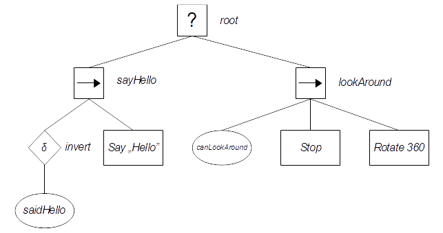

## What's this project?

This is an extension of [behavior_tree](https://github.com/draghan/behavior_tree) project, which adds ability of defining behavior trees from a script language.

Project is based on [ChaiScript](https://github.com/ChaiScript/ChaiScript) library. It uses also [Catch2](https://github.com/catchorg/Catch2) for unit testing.

## How does it work?

Project introduces class `IScriptedBehaviorTree` as a base for concrete implementations of embedding an script language for `BehaviorTree` class.

At this moment there is implemented `ChaiScriptedBehaviorTree`, which defines interface for adding and positioning behavior nodes from ChaiScript. 
 
## Who will use this project?

Everyone who needs behavior trees' based AI system and don't want to hard coding their behavior trees structure. :) Project is distributed under [MIT license](https://opensource.org/licenses/MIT).

## An example

> Source code of this example you can find in [example.chai](./example.chai) and [main.cpp](./main.cpp).

Let's define the same tree like in the [behavior_tree example](https://github.com/draghan/behavior_tree/blob/master/README.md#an-example), but from the ChaiScript's level. :)



We have designed our tree for simple behavior: actor has to say "hello" once and then it should look around. 

Let's implement a C++ base for further scripted extension:

```C++
// C++

#include "scripted_behavior_tree/ChaiScriptedBehaviorTree.hpp"

void evaluate_bt(BehaviorTree &bt);

int main()
{
    // The main difference against regular
    // BehaviorTree is that you have to provide
    // a path to the script file in the constructor
    // and then call load_tree() method, which could
    // throw an exception.
    // You have to be careful when evaluating an
    // ChaiScriptedBehaviorTree - if there are bugs
    // in script file, an exception will be thrown.
    const std::string script_path{"./example.chai"};
    ChaiScriptedBehaviorTree bt{script_path};
    try
    {
        bt.load_tree();

        std::cout << "#nodes: " << bt.get_node_count() << '\n';
        bt.print(std::cout);
        
        evaluate_bt(bt);
        evaluate_bt(bt);
    }
    catch(std::exception &ex)
    {
        std::cerr << "Oooops, your's Chai is cold now. :<\n" << ex.what();
        return 1;
    }
}

void evaluate_bt(BehaviorTree &bt)
{
    static size_t counter = 0;

    // some printing...
    std::cout << "----- " << counter++ << ". eval: \n";

    // go back to root node wherever our tree actually is:
    bt.set_at_absolutely();
    auto tree_state = bt.evaluate();

    // some more printing...
    switch(tree_state)
    {
        case BehaviorState::undefined:
        {
            std::cout << "\nundefined\n";
            break;
        }
        case BehaviorState::success:
        {
            std::cout << "\nsuccess\n";
            break;
        }
        case BehaviorState::failure:
        {
            std::cout << "\nfailure\n";
            break;
        }
        case BehaviorState::running:
        {
            std::cout << "\nrunning\n";
            break;
        }
    }
}
```

Let's assume that we have some class where `saidHello` is an bool member variable, `canLookAround` is some method which checks whether actor could looks around or not and we've prepared our actor for doing all of the stuff described in action nodes, like `Stop` or `Say`, etc.. Simple dummy class `Actor` satisfies those assumptions:

```ChaiScript
// ChaiScript

// dummy mock class represents an Actor
class Actor
{
    // c-tor
    def Actor()
    {
        this.saidHello = False;
        this.rotating = False;

        this.lookAroundCounter = 0;
        this.lookAroundLimiter = 5;
        this.stoppedCounter = 0;
        this.rotateCounter = 0;
    }

    // methods
    def sayHello()
    {
        print("Hello!\n");
        this.saidHello = True;
    }

    def canLookAround()
    {
        if(this.lookAroundCounter >= this.lookAroundLimiter)
        {
            return False;
        }

        ++this.lookAroundCounter;
        return True;
    }

    def isStopped()
    {
        ++this.stoppedCounter;

        if(this.stoppedCounter % 3 == 0) // 2/3 of checks will fail
        {
            return True;
        }
        return False;
    }

    def stop()
    {
        print("Stop.");
    }

    def isStillRotating()
    {
        if(this.rotating == False)
        {
            return False;
        }

        ++this.rotateCounter;

        if(this.rotateCounter % 5 == 0) // 4/5 of checks will confirm that actor is rotating
        {
            return False;
        }
        return True;
    }

    def rotate(degrees)
    {
        if(this.rotating == True)
        {
            return;
        }
        this.rotating = True;
        print("I'll turn ${degrees} degrees!\n");
    }

    // class' data
    var saidHello;
    var rotating;

    var lookAroundCounter;
    var lookAroundLimiter;
    var stoppedCounter;
    var rotateCounter;
}
```  
Lets create an instance of the `Actor` class:

```ChaiScript
// ChaiScript

global hero = Actor();
```

Every instance of `ChaiScriptedBehaviorTree` has registered for script a global variable called `BT` of BehaviorTree type, which points to `this`.
In the script you just call positioning and adding methods on the `BT` object. All the rules from `BehaviorTree` are still in effect. 

Let's implement the behavior tree:

```ChaiScript
// ChaiScript

BT.AddSelector(); // root

BT.AddSequence(); // sayHello
BT.AddSequence(); // lookAround

// set active node: first (zero-based indexing) child of root:
BT.SetAtAbsolutely(0);

BT.AddInvert();

// go to first child of invert decorator node:
BT.SetAtRelatively(0);

// saidHello condition node:
BT.AddCondition(fun()
               {
                   return hero.saidHello;
               });

// get back to the 'sayHello' sequence:
BT.SetAtAbsolutely(0);

// add say "Hello" action node:
BT.AddAction(fun()
            {
                hero.sayHello();
                return StateSuccess;
            });

// set as active 'lookAround' sequence:
BT.SetAtAbsolutely(1);

// canLookAround condition node:
BT.AddCondition(fun()
               {
                   return hero.canLookAround();
               });

// Stop action node:
BT.AddAction(fun()
            {
                if(hero.isStopped() == True)
                {
                    return StateSuccess;
                }
                hero.stop();
                return StateRunning;
            });

// Rotate360 action:
BT.AddAction(fun()
            {
                hero.rotate(360);
                if(hero.isStillRotating() == True)
                {
                    return StateRunning;
                }
                return StateSuccess;
            });

```

And... that's all. You have the host application with easily extensible behavior tree, loaded in runtime.

If you feel confused of the example code, please look at the [example in behavior_tree project](https://github.com/draghan/behavior_tree/blob/master/README.md#an-example) first.

> Source code of this example you can find in [example.chai](./example.chai) and [main.cpp](./main.cpp).

## Registered interface for scripting

> Identifiers are listed as follows:
> 1. `ChaiScript version` as `C++ equivalent`

#### Mapping of BehaviorState enum:
1. `BehaviorState` as `BehaviorState`
1. `StateFailure` as `BehaviorState::failure`
1. `StateSuccess` as `BehaviorState::success`
1. `StateRunning` as `BehaviorState::running`

#### Mapping of BehaviorTree class:
1. `BT` as the reference to an instance of `BehaviorTree` class
1. `AddSelector` as `BehaviorTree::add_selector`
1. `AddSequence` as `BehaviorTree::add_sequence`
1. `AddAction` as `BehaviorTree::add_action`
1. `AddCondition` as `BehaviorTree::add_condition`
1. `AddInvert` as `BehaviorTree::add_invert`
1. `AddLoop` as `BehaviorTree::add_loop`
1. `AddMaxNTries` as `BehaviorTree::add_max_N_tries`
1. `SetAtId` as `BehaviorTree::set_at_id`
1. `SetAtAbsolutely` as `BehaviorTree::set_at_absolutely`
1. `SetAtRelatively` as `BehaviorTree::set_at_relatively`